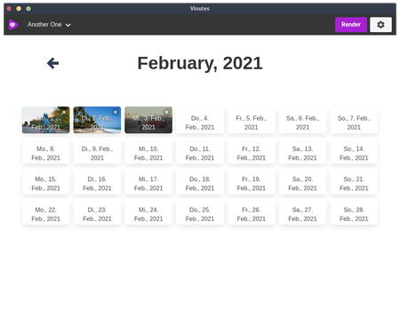

#  Vinutes

Chose one video or image for every day of your life (or maybe your cat's life, we are not judging) and combine them to a video.
Powered by ffmpeg and electron and inspired by the android app _1-Second-Everyday_ but for free, open source, and on the desktop.

## Screenshot


## Project setup
Nothing special:
```
yarn install
```
Followed by
```
yarn run serve
```
And if you want to build an executable for your platform:
```
yarn run build
```

## Features

* multiple timelines
* support for videos and images
* choose position of the video
* multiple render options (whole timeline, month or custom time span)
* display date in rendered video
* multi language support (currently english and german)
* custom date formats

## Troubleshooting

### Better-Sqlite complains about wrong node.js version
```
./node_modules/.bin/electron-rebuild -f -w better-sqlite3
```

## Acknowledgements
* Videos used for testing and screenshots from Pexels