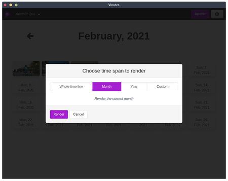

#  Vinutes

Chose one video or image for every day of your life (or maybe your cat's life, we are not judging) and combine them to a video.
Powered by ffmpeg and electron and inspired by the android app _1-Second-Everyday_ but for free, open source, and on the desktop.

## Help Wanted!

This is currently a one-man-show and this man doesn't have UX/UI skill, no Mac and hates to fire up
Windows. I could really need some help in those areas. And everywhere else, to be honest.

## Screenshots





## Features

* cross platform (runs on linux, windows and [almost mac](https://github.com/danielroehrig/vinutes/issues/34))
* multiple timelines
* support for videos and images
* choose position of the video
* multiple render options (whole timeline, month or custom time span)
* Drag images and videos from your file manager directly into the calendar
* display date in rendered video
* multi language support (currently english and german)
* custom date formats

## Project setup
Nothing special:
```
yarn install
```
Followed by
```
yarn run serve
```
And if you want to build an executable for your platform:
```
yarn run build
```


## Troubleshooting

### Better-Sqlite complains about wrong node.js version
```
./node_modules/.bin/electron-rebuild -f -w better-sqlite3
```

### Complaining about libvips-cpp.so.42 shared object not found or similar 
No joke, but I solved it with good old:
```
rm -rf node_modules
yarn install
```

## Acknowledgements
* Videos used for testing and screenshots from Pexels